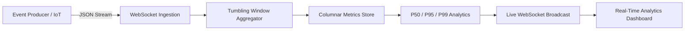

# 🌊 StreamForge Analytics

[](https://opensource.org/licenses/MIT)
[](https://www.python.org/)
[](https://fastapi.tiangolo.com)

High-throughput, real-time event streaming and analytical windowing engine with live WebSocket pub/sub.

---

## 🏛️ Pipeline Flow



## 🚀 Features

- **Tumbling & Sliding Windowing**: Micro-batch aggregation with configurable time horizons.
- **Statistical Rollups**: Computes p50, p95, p99 latency distributions on the fly.
- **AsyncIO Concurrency**: Broadcasts analytics to thousands of connected clients with low memory overhead.

## 🛠️ Usage

```bash
pip install -r requirements.txt
uvicorn src.api.server:app --port 8000
```

## 📜 License
MIT License. Built by [Shashank Shrivastva](https://github.com/shashankshrivastva-hue).
